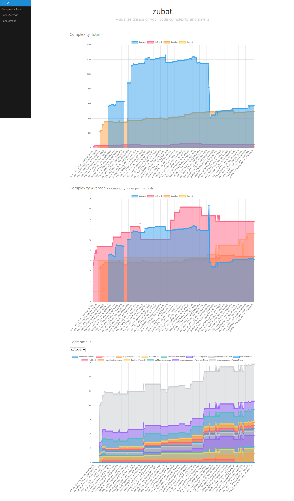

# Zubat

zubat is a gem that wraps around static analysis gems [Reek](https://github.com/troessner/reek) and [Flog](https://github.com/seattlerb/flog) to visualize trends' report of your Ruby code quality.

## Installation

Install the gem and add to the application's Gemfile by executing:

    $ bundle add zubat

If bundler is not being used to manage dependencies, install the gem by executing:

    $ gem install zubat

## Usage

```sh
$ zubat path/to/awesome.rb
```

There are a few options

```sh
Usage: zubat [OPTIONS] FILE [FILE]...
    -s, --silent
        --root=ROOT
```

## Screenshot

```sh
# For example, runs the following command under the ruby project root. It reports the result as shown in the screenshot below.

$ zubat lib/find.rb lib/csv.rb lib/uri.rb lib/set.rb
```



## Development

After checking out the repo, run `bin/setup` to install dependencies. Then, run `rake spec` to run the tests. You can also run `bin/console` for an interactive prompt that will allow you to experiment.

To install this gem onto your local machine, run `bundle exec rake install`. To release a new version, update the version number in `version.rb`, and then run `bundle exec rake release`, which will create a git tag for the version, push git commits and the created tag, and push the `.gem` file to [rubygems.org](https://rubygems.org).

## Contributing

Bug reports and pull requests are welcome on GitHub at https://github.com/mizoR/zubat.

## License

The gem is available as open source under the terms of the [MIT License](https://opensource.org/licenses/MIT).
